# :fire::fire: Welcome to "Find Job" - Your Ultimate Job Search and Recruitment Solution! :fire::fire:

**Find Job** is your go-to platform whether you're on the lookout for your dream job or seeking the perfect candidate
for your organization. With us, the power is in your hands!let's see what we have!

## Table of Contents

- [For Job Seekers](#for-job-seekers)
- [For Employers](#for-employers)
- [Join the "Find Job" Community Today](#join-the-find-job-community-today)
- [Getting started with Find Job](#get-start)

## For Job Seekers <a name="for-job-seekers"></a>

Are you on the hunt for a fulfilling career opportunity? Look no further! With **Find Job**, your dream job is just a
click away. We connect you with the best employers and provide the tools you need to land that perfect role.

**Discover Exceptional Opportunities:**

- Browse thousands of job listings across various industries.
- Customize your job search with advanced filters to find the ideal match.
-

**Showcase Your Talent:**

- Create a captivating profile.
- Upload your resume and portfolio to make a strong impression.
- Get noticed by top employers actively looking for candidates like you.

**Seamless Application Process:**

- Apply for jobs effortlessly through our user-friendly interface.
- Track your applications and stay organized throughout your job search.

## For Employers <a name="for-employers"></a>

Finding the perfect candidate for your team has never been easier. **Find Job** provides you with the tools and
resources to streamline your recruitment process and build a stellar workforce.

**Efficient Recruitment Solutions:**

- Post job openings quickly and easily.
- Access a pool of qualified candidates actively seeking employment.
- Utilize our applicant tracking system to manage applications effectively.

**Connect with Top Talent:**

- Explore detailed candidate profiles and resumes.
- Find the right fit for your organization with confidence.

**Build Your Brand:**

- Enhance your company's visibility with a compelling employer profile.

## Join the "Find Job" Community Today <a name="join-the-find-job-community-today"></a>

Whether you're a job seeker or an employer, **Find Job** is your trusted partner in the world of employment. Join our
thriving community and take the next step toward your career goals.

# Getting Started with "Find Job" Laravel Project <a name="get-start"></a>

Follow these steps to set up and run the "Find Job" Laravel project on your local machine.

## Prerequisites

Before you begin, ensure you have the following prerequisites installed:

- [PHP](https://php.net) (Recommended version: 7.3 or higher)
- [Composer](https://getcomposer.org)
- [Node.js](https://nodejs.org) (for Laravel Mix, if needed)
- [npm](https://www.npmjs.com) (for Laravel Mix, if needed)

## Clone the Repository

```bash
git clone git@github.com:amirhossein2831/Job_Application.git
```

to make sure the link is correct copy it from the github project page

## open the project directory

```bash
cd find-job
```

## Initial Composer

```bash
composer init
composer install
```

## Update the Composer

```bash
composer update
```

## Configure Environment

```bash
cp .env.example .env
```

## Database Configure

```php
DB_CONNECTION=mysql
DB_HOST=YourHost
DB_PORT=YourPort
DB_DATABASE=YourDBName
DB_USERNAME=DBUsername
DB_PASSWORD=DBPassword
```

## Email Sender Configure

```php
MAIL_MAILER=MailerType
MAIL_HOST=YourHost
MAIL_PORT=YourPort
MAIL_USERNAME=YourUsername
MAIL_PASSWORD=YourPassword
```

you can get a free one from mail trap

## Migrate the Database

```bash
php artisan migrate
```

## Queue work

```bash
php artisan queue:work
```

## Create the Storage Link

```bash
php artisan storage:link
```

## Start the Development Server

```bash
php artisan serve
```

<br>
every thing is ready to go 

Visit <a href="http://localhost:8000">http://localhost:8000</a> in your web browser to access the application.
this is what you should see
<br><br>


## Login and Register as User

if you had already register just login but if you don't register
<table>
  <tr>
    <td></td>
    <td></td>
  </tr>
 </table>

and be careful about the validation rule
<table>
  <tr>
    <td></td>
    <td></td>
  </tr>
 </table>

## Verify your Email

now the email verification send to your email check it and verify that is you
after verification you redirect to the jobs pages
<table>
  <tr>
    <td>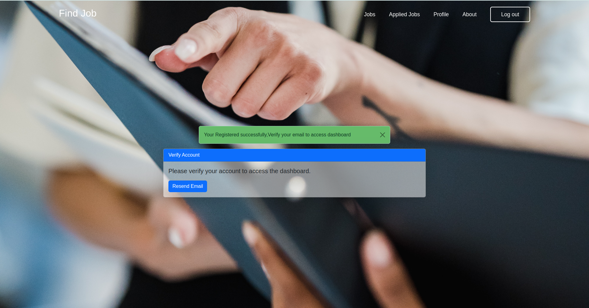</td>
    <td>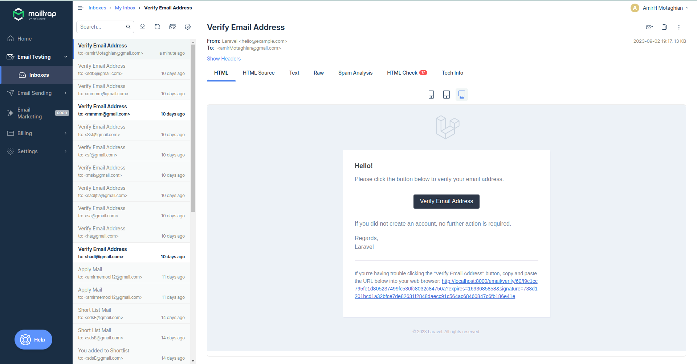</td>
  </tr>
 </table>

## Profile

you can edit your profile,add about,profile picture,resume,change password ...
<table>
  <tr>
    <td>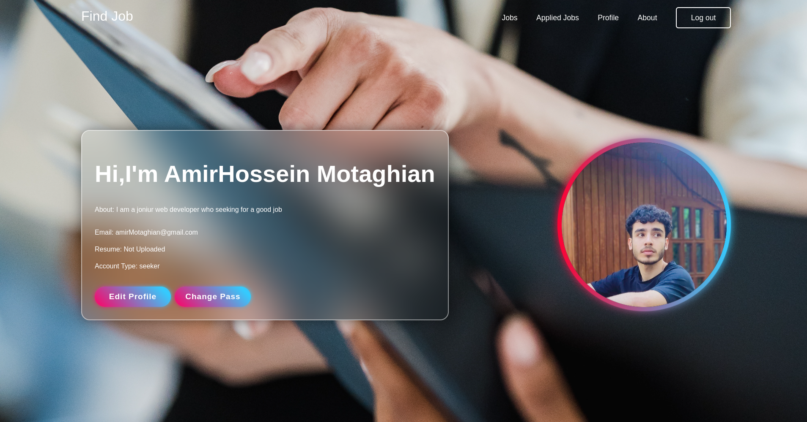</td>
    <td>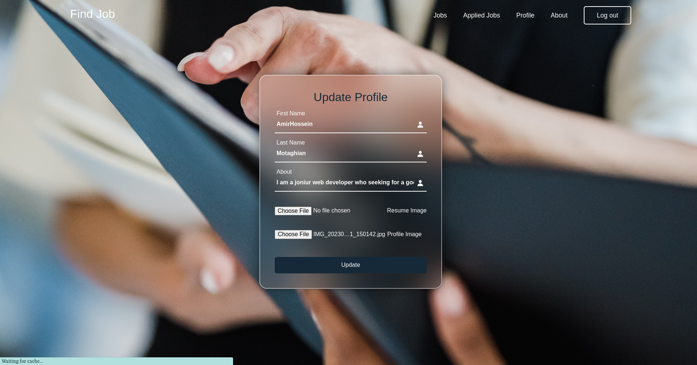</td>
  </tr>
 <tr>
    <td></td>
    <td>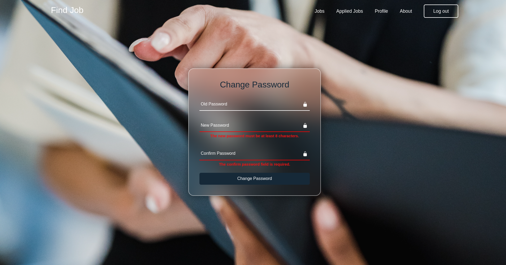</td>
  </tr>
 </table>

## List of Jobs

you can see the all jobs with pagination,add filter base on your need and also you can see the list of the job that you
applied.after applying for the job a notification email will send for the company<br>
you can also see more detail about job by click on that and also see all the job from the company by click on the
company name.
<table>
  <tr>
    <td>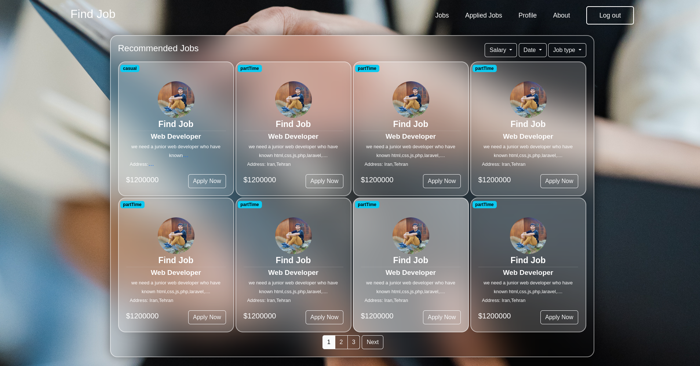</td>
    <td>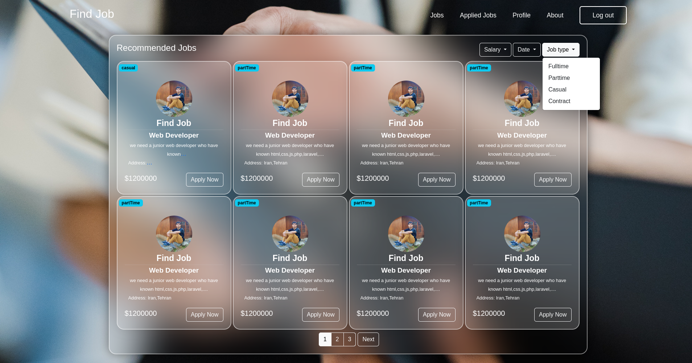</td>
  </tr>
 <tr>
    <td>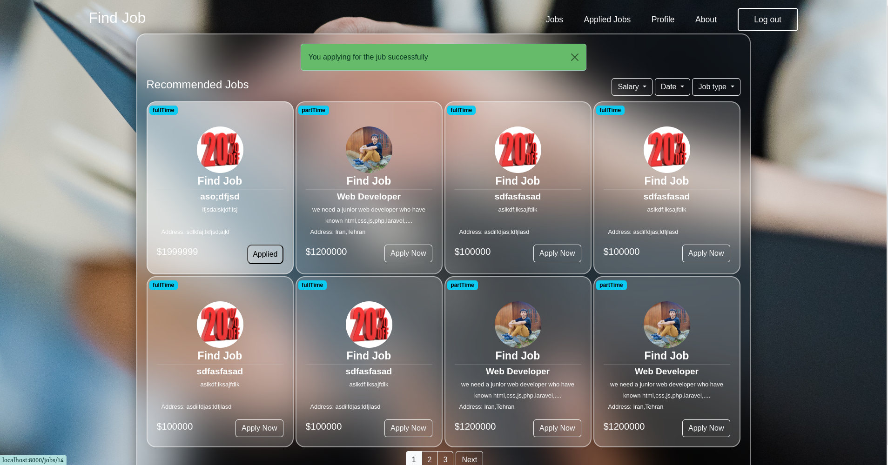</td>
    <td>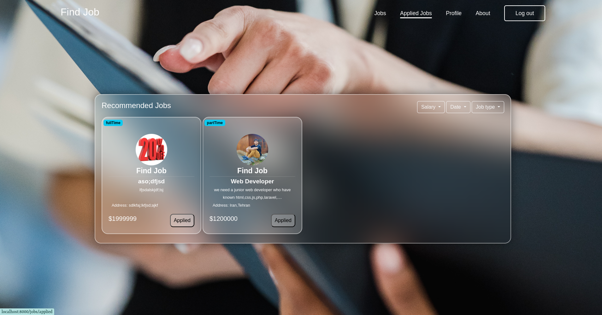</td>
  </tr>
<tr>
    <td>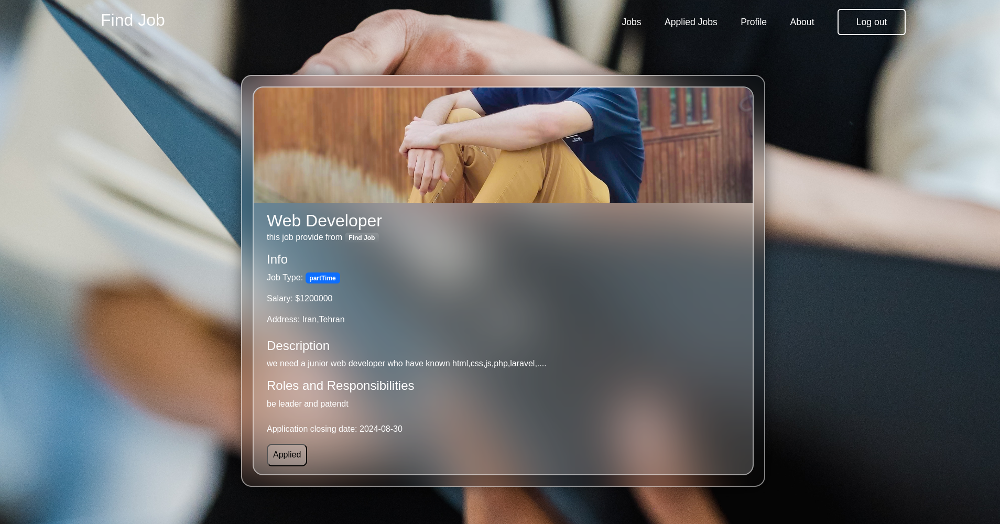</td>
    <td>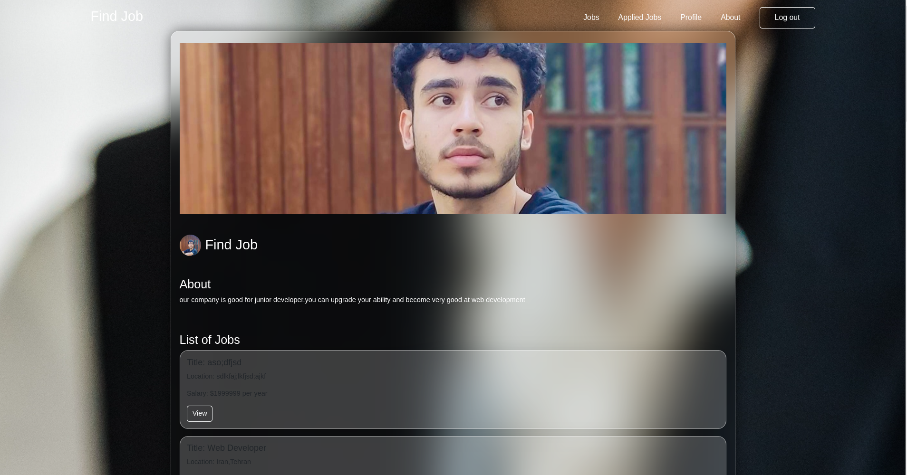</td>
  </tr>
 </table>

## Employee

just go and login with the employee if you don't have account create an employee account and verify it just like user
account.and just like user the employee has profile page can edit it and change password<br>
as employee you have 7day trial after that you need to buy subscription don't worry you don't need to pay just select
one the plan and let's go.
<br>

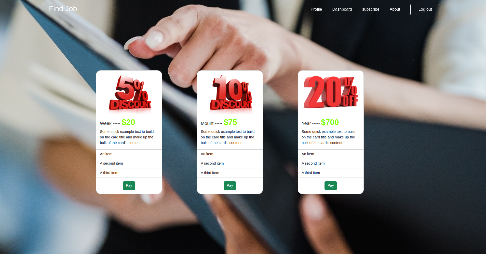

## Dashboard

employees has dashboard where they can create job,update and delete it, they can see the applicants for the job and
shortlist (in this case a notification email send to user) them or delete them.
<table>
<tr>
    <td>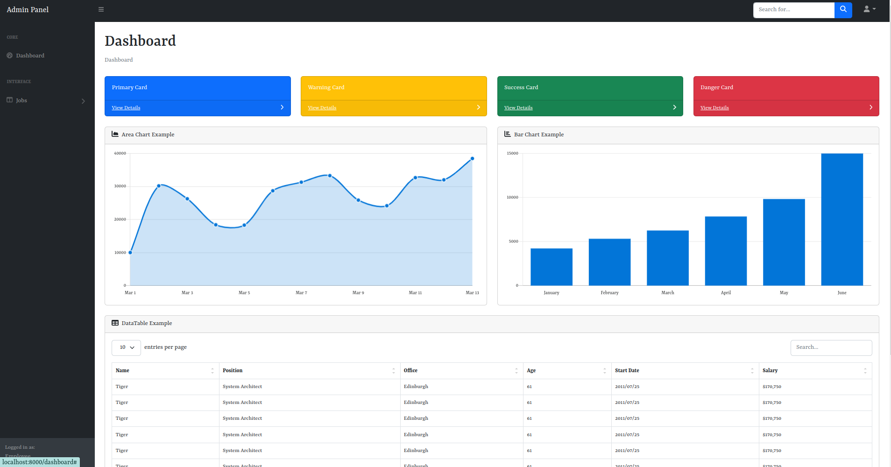</td>
    <td>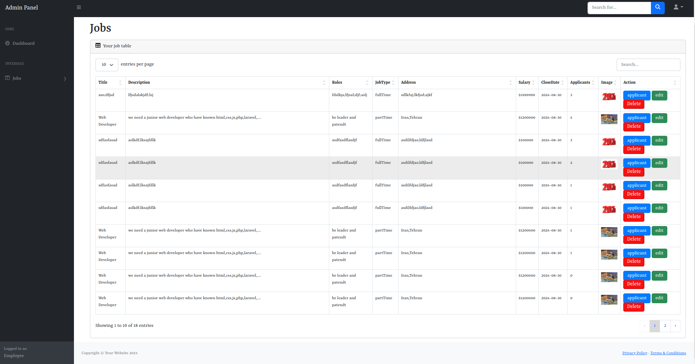</td>
  </tr>
 <tr>
    <td>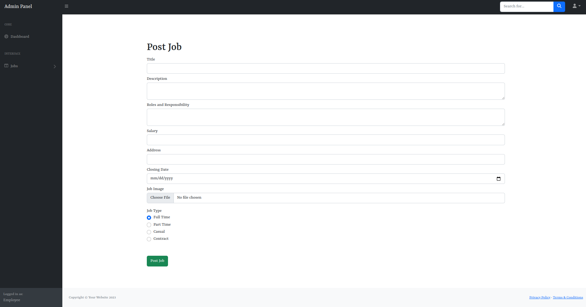</td>
    <td>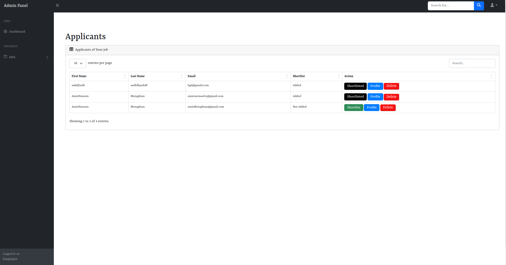</td>
  </tr>
 </table>

## Download Resume

employee can download the resume of the applicant by going to the profile of them and download the resume
<br>


## Technologies Used

<ul>
<li>
Front
    <ul>
        <li>Html</li>
        <li>Css</li>
        <li>Js</li>
        <li>Bootstrap</li>
        <li>blade template</li>
    </ul>
</li>
<li>
Back
    <ul>
    <li><a href="https://laravel.com/docs/10.x">Laravel</a></li>
    <li>MYSQL</li>
    <li>MVC Architecture</li>
    </ul>
</li>
</ul>

## License
The Find job project is licensed under the MIT License. You are free to modify and distribute the project according to the terms of the license.

## Contributing
<ol>
<li>Fork the repository.</li>
<li>Create a new branch for your feature or bug fix.</li>
<li>Make your changes and ensure that the codebase passes all tests.</li>
<li>Submit a pull request describing your changes.</li>
</ol>
