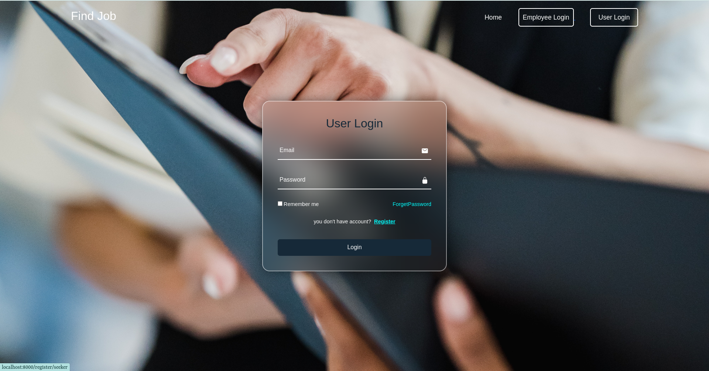
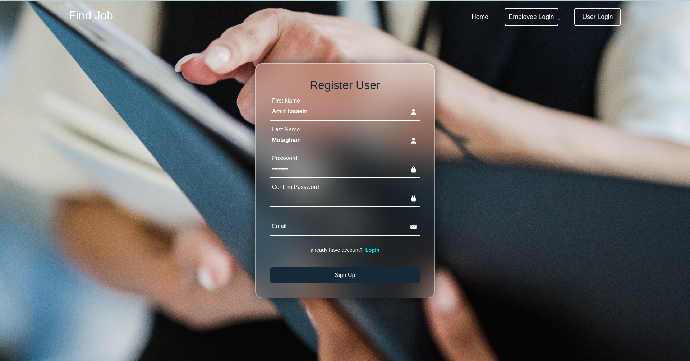
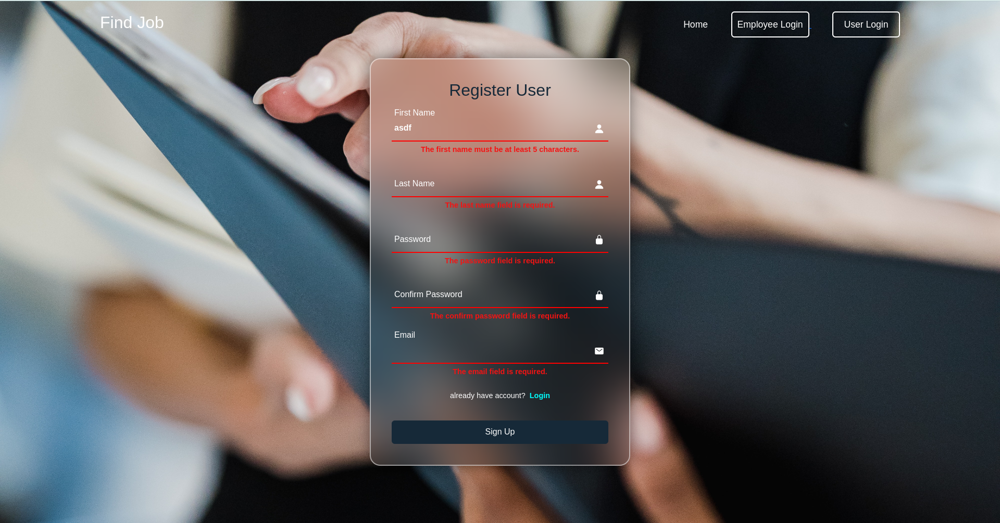

# :fire::fire: Welcome to "Find Job" - Your Ultimate Job Search and Recruitment Solution! :fire::fire:

**Find Job** is your go-to platform whether you're on the lookout for your dream job or seeking the perfect candidate
for your organization. With us, the power is in your hands!let's see what we have!

## Table of Contents

- [For Job Seekers](#for-job-seekers)
- [For Employers](#for-employers)
- [Join the "Find Job" Community Today](#join-the-find-job-community-today)
- [Getting started with Find Job](#get-start)

## For Job Seekers <a name="for-job-seekers"></a>

Are you on the hunt for a fulfilling career opportunity? Look no further! With **Find Job**, your dream job is just a
click away. We connect you with the best employers and provide the tools you need to land that perfect role.

**Discover Exceptional Opportunities:**

- Browse thousands of job listings across various industries.
- Customize your job search with advanced filters to find the ideal match.
- 
**Showcase Your Talent:**

- Create a captivating profile.
- Upload your resume and portfolio to make a strong impression.
- Get noticed by top employers actively looking for candidates like you.

**Seamless Application Process:**

- Apply for jobs effortlessly through our user-friendly interface.
- Track your applications and stay organized throughout your job search.

## For Employers <a name="for-employers"></a>

Finding the perfect candidate for your team has never been easier. **Find Job** provides you with the tools and resources to streamline your recruitment process and build a stellar workforce.

**Efficient Recruitment Solutions:**

- Post job openings quickly and easily.
- Access a pool of qualified candidates actively seeking employment.
- Utilize our applicant tracking system to manage applications effectively.

**Connect with Top Talent:**

- Explore detailed candidate profiles and resumes.
- Find the right fit for your organization with confidence.

**Build Your Brand:**

- Enhance your company's visibility with a compelling employer profile.

## Join the "Find Job" Community Today <a name="join-the-find-job-community-today"></a>

Whether you're a job seeker or an employer, **Find Job** is your trusted partner in the world of employment. Join our thriving community and take the next step toward your career goals.

# Getting Started with "Find Job" Laravel Project <a name="get-start"></a>

Follow these steps to set up and run the "Find Job" Laravel project on your local machine.

## Prerequisites

Before you begin, ensure you have the following prerequisites installed:

- [PHP](https://php.net) (Recommended version: 7.3 or higher)
- [Composer](https://getcomposer.org)
- [Node.js](https://nodejs.org) (for Laravel Mix, if needed)
- [npm](https://www.npmjs.com) (for Laravel Mix, if needed)

## Clone the Repository

```bash
git clone git@github.com:amirhossein2831/Job_Application.git
```
to make sure the link is correct copy it from the github project page

## open the project directory
```bash
cd find-job
```

## Initial Composer
```bash
composer init
composer install
```

## Update the Composer
```bash
composer update
```

## Configure Environment
```bash
cp .env.example .env
```

## Database Configure
```php
DB_CONNECTION=mysql
DB_HOST=YourHost
DB_PORT=YourPort
DB_DATABASE=YourDBName
DB_USERNAME=DBUsername
DB_PASSWORD=DBPassword
```

## Email Sender Configure
```php
MAIL_MAILER=MailerType
MAIL_HOST=YourHost
MAIL_PORT=YourPort
MAIL_USERNAME=YourUsername
MAIL_PASSWORD=YourPassword
```
you can get a free one from mail trap

## Migrate the Database
```bash
php artisan migrate
```

## Create the Storage Link
```bash
php artisan storage:link
```

## Start the Development Server
```bash
php artisan serve
```

<br>
every thing is ready to go 

Visit <a href="http://localhost:8000">http://localhost:8000</a> in your web browser to access the application.
this is what you should see


## Login and Register as User
if you had already register just login but if you don't register

<p align="center">

&nbsp; &nbsp; &nbsp; &nbsp;

</p>

and be careful about the validation rule
<p float="left">

&nbsp;&nbsp;&nbsp;&nbsp;&nbsp;

<p>


[Get Started](link-to-sign-up) | [Learn More](link-to-learn-more)

- [Simple, fast routing engine](https://laravel.com/docs/routing).
- [Powerful dependency injection container](https://laravel.com/docs/container).
- Multiple back-ends for [session](https://laravel.com/docs/session) and [cache](https://laravel.com/docs/cache)
  storage.
- Expressive, intuitive [database ORM](https://laravel.com/docs/eloquent).
- Database agnostic [schema migrations](https://laravel.com/docs/migrations).
- [Robust background job processing](https://laravel.com/docs/queues).
- [Real-time event broadcasting](https://laravel.com/docs/broadcasting).

Laravel is accessible, powerful, and provides tools required for large, robust applications.

## Learning Laravel

Laravel has the most extensive and thorough [documentation](https://laravel.com/docs) and video tutorial library of all
modern web application frameworks, making it a breeze to get started with the framework.

You may also try the [Laravel Bootcamp](https://bootcamp.laravel.com), where you will be guided through building a
modern Laravel application from scratch.

If you don't feel like reading, [Laracasts](https://laracasts.com) can help. Laracasts contains over 2000 video
tutorials on a range of topics including Laravel, modern PHP, unit testing, and JavaScript. Boost your skills by digging
into our comprehensive video library.

## Laravel Sponsors

We would like to extend our thanks to the following sponsors for funding Laravel development. If you are interested in
becoming a sponsor, please visit the Laravel [Patreon page](https://patreon.com/taylorotwell).

### Premium Partners

- **[Vehikl](https://vehikl.com/)**
- **[Tighten Co.](https://tighten.co)**
- **[Kirschbaum Development Group](https://kirschbaumdevelopment.com)**
- **[64 Robots](https://64robots.com)**
- **[Cubet Techno Labs](https://cubettech.com)**
- **[Cyber-Duck](https://cyber-duck.co.uk)**
- **[Many](https://www.many.co.uk)**
- **[Webdock, Fast VPS Hosting](https://www.webdock.io/en)**
- **[DevSquad](https://devsquad.com)**
- **[Curotec](https://www.curotec.com/services/technologies/laravel/)**
- **[OP.GG](https://op.gg)**
- **[WebReinvent](https://webreinvent.com/?utm_source=laravel&utm_medium=github&utm_campaign=patreon-sponsors)**
- **[Lendio](https://lendio.com)**

## Contributing

Thank you for considering contributing to the Laravel framework! The contribution guide can be found in
the [Laravel documentation](https://laravel.com/docs/contributions).

## Code of Conduct

In order to ensure that the Laravel community is welcoming to all, please review and abide by
the [Code of Conduct](https://laravel.com/docs/contributions#code-of-conduct).

## Security Vulnerabilities

If you discover a security vulnerability within Laravel, please send an e-mail to Taylor Otwell
via [taylor@laravel.com](mailto:taylor@laravel.com). All security vulnerabilities will be promptly addressed.

## License

The Laravel framework is open-sourced software licensed under the [MIT license](https://opensource.org/licenses/MIT).
